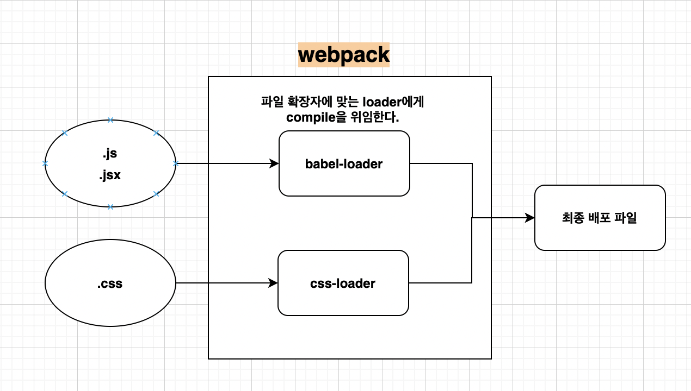

#

## React & Redux

#

## React

<br/>

### 개념

- [React concpet](#React-concept)
- [React 핵심 모듈(React와 ReactDOM)](#React-핵심-모듈)
- [class Component와 function Component](#class-Component와-function-Component)
- [React.CreateElement()](<#React.CreateElement()>)
- [JSX](#JSX)
- [Props 와 State](#Props와-State)
- [Event Handling](#Event-Handling)
- [Component LifeCycle](#Component-LifeCycle)
- [React Developer tools](#React-Developer-tools)

### 리액트 프로젝트 생성

- [Create React App](#Create-React-App)
- [의존 라이브러리들](#Create-React-App-dependencies)
- [Create React App 시작 코드 이해하기](#Create-React-App-시작-코드-이해하기) (나중에 추가)
- [React Developer tools](#React-Developer-tools)(나중에 추가)

### 리액트 라우터
- [리액트 라우터 이해하기](#리액트-라우터-이해하기)
- [Dynamic routing](#Dynamic-routing)
- [Switch와 "Not Found" 처리](#Switch와-"404-Not-Found"-처리)
- [JSX 링크 라우팅 이동](#JSX-링크-라우팅-이동)
- [JS 에서 라우팅 이동](#JS-에서-라우팅-이동)

### 컴포넌트 스타일링
- [Style Loaders](#Style-Loaders)   
- [Styled Components(스타일 라이브러리)](#Styled-Components(스타일-라이브러리))


### 리액트 활용
-[Higher Order Component](#Higher-Order-Component)   
-[Controlled Component 와 UnControlled Component](#Controlled-Component-와-UnControlled-Component)

### Hooks & Context
-[basic hook](#basic-hook)   
-[Custom hook](#Custom-hook)

<br/>


#
## Redux

<br/>

### Redux basic
-[리덕스란?](#1.리덕스란?)   
-[Action](#2.-action)   
-[Reducer](#3.reducer)    
-[Store](#4.store)    
-[combineReducers](#5.combineReducers)
#

> 프레임워크 별 비교

| 종류 | angular                                                         | react                                         | vue                                                |
| ---- | --------------------------------------------------------------- | --------------------------------------------- | -------------------------------------------------- |
| 특징 | 거의 모든기능(인증 , 테스트 등등 ..)이 프레임워크 안에 들어있다 | View를 업데이트 하는 것에 초점이 맞춰져 있다. | angular의 특징과 react의 특징을 모두 실현하려한다. |
| 지향 | framework지향                                                   | library지향                                   | 둘다 지향sCode                                     |

#

#

### React concept

#

> 1.Component based development  
> -내장되어 있는 태그들을 조합하여 컴포넌트를 만들고 그 안에 동작(js),스타일(css),문서(html)을 조합하여 재활용하는 방식을 말한다.

</br>

```html
//component란?

<!-- HTMLElement -->
<!-- img 태크의 src 속성을 정의해 표현한다 -->

<!-- button의 class 속성을 정의해 button을 표현한다. -->
<button class="클래스 이름">버튼</button>

<!--Component-->
<!-- 컴포넌트는 태그를 정의하고 속성을 설정하여 표현할 수 있는 하나의 구성을 말한다 -->

<컴포넌트이름 name = 'Ugo'>
<컴포넌트이름 prop = {false}>내용</컴포넌트이름>
```

> 2.Virtual DOM  
>  -DOM에 대한 제어를 React에 맡기고 React는 가상의 돔 트리를 사용해서  
>  이전과 이후 상태를 비교하여 바뀐 부분(diff)를 찾아내어 Re-render 한다.

</br>


</br>

> 3.React Client Side Rendering(CSR)  
>  React는 javascript로 이루어진 애플리케이션이기 때문에 리액트로 만들어진 웹서비스에  
>  접근할때 js 파일이 다운 받아져야지 실행이 가능하다 이루어진다

-CSR 과정

1.유저가 ReactApp에 접근시 빈 Html이 먼저 다운 받아지고  
 2.다음으로 Html에 정의된 JS파일을 요청한다.  
 3.브라우저는 다운받은 js 파일(리액트앱)을 실행하고  
 4.리액트 컴포넌트들이 화면에 그려진다  
 5.Page Viewable Interactable .

#

### React 핵심 모듈

#

```js
//1. 리액트 컴포넌트 => HTMLElement 연결
import ReactDOM from 'react-dom';

//2. 리액트 컴포넌트 생성
import React from 'react';

//js , jsx 로 만들어진 컴포넌트를
//HTMLElement에 연결
ReactDOM.render(
    <HelloMsg name = "Ugo"/>
    document.getElementById('hello');
);

//컴포넌트 생성
class HelloMsg extends React.Component{
    render(){
        return(
            <div>
                Hello {this.props.name}
            </div>
        )
    }
}

```

#

### class Component와 function Component

#

> 1.컴포넌트 생성 , 사용

```js
//1.class 컴포넌트 정의
//React 컴포넌트로 선언 (React.Compent 상속)
class ClassComponent extends React.Component {
  render() {
    return <div>ClassComponent</div>;
  }
}

//컴포넌트 사용
ReactDOM.render(<ClassComponent />, document.querySelector("#root"));

//2.function 컴포넌트 정의

//정의1
function FunctionComponent() {
  //jsx를 리턴해줘야 한다.
  return <div>Hello</div>;
}

//정의2
const FunctionComponent = () => <div>Hello</div>;

//컴포넌트 사용
ReactDOM.render(<FunctionComponent />, document.querySelector("#root"));
```

#

### React.CreateElement()

#

> React에서 요소를 만들어내는 메서드이다 파라미터 첫번째 인자로 리액트 컴포넌트,
> 두번째로 props, 세번째는 자식으로 넣어줄 요소들이 들어간다.

```js
React.createElement(
  type, //태그 이름 문자열 | 리액트 컴포넌트 자체 | React.Fragment
  [props], //리액트 컴포넌트에 넣을 데이터 객체
  [...children] //자식으로 넣어주는 요소들
);

//1. 태그이름 문자열으로 컴포넌트 생성
ReactDOM.render(
  React.createElement("h1", null, `태그이름 문자열 타입`),
  document.querySelector("#root")
);

//2.리액트 컴포넌트 타입
const Component = () => <h1>리액트 컴포넌트 타입</h1>;

ReactDOM.render(<Component />, document.querySelector("#root"));

//3.React.Fragment
//특정 요소를 만들어내지 않고
//원하는 위치에 바로 자식요소를 배열쳐렴 녛고 싶을 때
//Fragment를 사용한다.
ReactDOM.render(
  React.createElement(
    React.Fragment,
    null,
    `<button>1</button>`,
    `<button>2</button>`,
    `<button>3</button>`
  ),
  document.querySelector("#root")
);

// 4. 복잡한 리액트 엘리먼트 모임 (createElement의 한계)
// <div>
//     <ul>
//         <li>React</li>
//         <li>Vue</li>
//     </ul>
// </div>
// 위와 같은 HTML 을 컴포넌트로 만들어 내려면?

//같은 코드가 반복된다
//가독성이 낮다
ReactDOM.render(
  React.createElement(
    "div",
    null,
    React.createElement(
      "ul",
      null,
      React.createElement(
        React.Fragment,
        null,
        React.createElement("li", null, `REACT`),
        React.createElement("li", null, `VUE`)
      )
    )
  ),
  document.querySelector("#root")
);

//위와 같은 문제를 해결하기 위해 JSX를 사용한다
```

#

### JSX

#

> 리액트에서 요소를 만들때 사용하는 문법이다 . 가독성이 좋다. jsx 는 바벨을 통해 js로 컴파일되기 때문에 문법적 오류를 인지하기 쉽다.

```js
//jsx

ReactDOM.render(
    <div>
        <ul>
            <li>React</li>
            <li>Vue</li>
        </ul>
    </div>
    ,
    document.querySelector('#root')
)
//아래 사이트에서 babel을 통해 jsx가 js 로 변환되는 것을 확인할 수 있다
https://babeljs.io/
```

<br/>

> JSX 문법 정리

```js
1. 최상위 요소는 하나여야 한다.
2. 최상위 요소를 리턴하는 경우 , ()로 감싸야한다.
3. 자식들을 바로 랜더링 하고 싶으면 ,<>자식들</>를 사용한다 => Fragment
4. 자바스크립트 표현식을 사용하려면 ,{표현식}을 이용한다.
5. if문은 사용할 수 없다 (삼항연산자 혹은 &&를 사용한다)
6. style을 이용해 인라인 스타일링이 가능하다 .
7. class 대신 className을 사용해야 class를 적용할 수 있다.
8. 자식요소가 있으면 ,꼭 닫아야 하고, 자식요소가 없으면 열면서 닫아야 한다.

```

#

### Props와 State

#

> Props는 컴포넌트 외부에서 컴포넌트에게 전달하는 데이터를 말하고 ,
> State는 컴포넌트 내부에서 변경할 수 있는 데이터를 말한다. Props 와 State에 변경이 일어날 시 컴포넌트는 해당 변경 사항을 re-render 하려한다.

<br/>

#### Render 함수

<br/>

> Props와 State를 바탕으로 컴포넌트를 그려내는 함수이다. Props와 State의 변경이 감지되면 해당 컴포넌트는 Render 함수를 다시 실행하여 변경 사항을 update 한다.

<br/>

#### Props 전달과 사용

<br/>

```js
//----funtion Component Props----
//함수 컴포넌트에서는 Props가 파라미터로 들어온다
function Component(props) {
  return (
    <div>
      <h1>{props.message} 함수 컴포넌트</h1>
    </div>
  );
}
ReactDOM.render(<Component message="gege" />, document.querySelector("#root"));

//----class Compent Props----
//클래스 컴포넌트에서는 this의 props라는 필드로 props가 들어온다,
class Component extends React.Component {
  render() {
    return (
      <div>
        <h1>{this.props.message} 클래스 컴포넌트</h1>
      </div>
    );
  }
}
ReactDOM.render(<Component message="hihi" />, document.querySelector("#root"));

//----default Props 정의----

//클래스 , 함수 모두 사용가능
Component.defaultProps = {
  message: "default message",
};
ReactDOM.render(<Component />, document.querySelector("#root"));

//클래스에서만 사용가능
class Component extends React.Component {
  render() {
    return (
      <div>
        <h1>{this.props.message} 클래스 컴포넌트</h1>
      </div>
    );
  }
  static defaultProps = {
    message: "static default",
  };
}
```

<br/>

### State

<br/>

```js
//클래스 컴포넌트에서 state 정의, 사용  ,수정

class Component extends React.Component {
  //state 정의
  //클래스에서 컴포넌트에서 state는 객체 형태이다
  state = {
    count: 0,
  };

  render() {
    return (
      <div>
        <h1>{this.props.message} 클래스 컴포넌트</h1>
        //state 사용
        <p>{this.state.count}</p>
      </div>
    );
  }
  componentDidMount() {
    setTimeout(() => {
      //state 수정 시에는 setState를 통해 수정해야한다.

      //state 수정 방식 1
      this.setState({
        count: this.state.count + 1,
      });

      //state 수정 방식 2
      //이전의 값을 활용해서 새로운 값을 만든다.
      this.setState((old) => {
        const newState = { count: old.count + 1 };
        return newState;
      });
    }, 1000);
  }
}
ReactDOM.render(
  <Component message="기본값 아님" />,
  document.querySelector("#root")
);
```

<br/>

#

### Event Handling

#

> HTML DOM 에 클릭하면 이벤트가 발생하고, 그에 맞는 변경이 일어나도록 이벤트를 Handling 한다. Recat에서는 JSX에 이벤트를 설정할 수 있다.

<br/>

    특징
    1.이벤트 명을 camelCase 로만 사용할 수 있다
    2.이벤트에 연결된 자바스크립트 코드는 함수이다 .
    3.실제 DOM 요소에만 사용 간으하다.

<br/>

```js
//function Component EventHandling
function Comp() {
  return (
    <div>
      <button
        onClick={() => {
          console.log("clicked");
        }}
      >
        클릭
      </button>
    </div>
  );
}

ReactDOM.render(<Comp />, document.querySelector("#root"));

//class Component EventHandling
class Comp2 extends React.Component {
  state = {
    count: 0,
  };
  //일반 함수 click()에 this를 바인딩하기 위한 방법 1
  constructor(props) {
    super(props);
    //클래스의 this 를 click()의 this에 바인딩 시킨다.
    this.click = this.click.bind(this);
  }

  render() {
    return (
      <div>
        <p>{this.state.count}</p>
        <button onClick={this.click}>plus</button>
      </div>
    );
  }

  /*
    일반 함수는 호출 위치에 따라 this 가 정의되고
    화살표 함수는 자신이 선언된 함수 범위에서 this가 정의된다.
    */

  click = () => {
    this.setState((old) => {
      const newCount = {
        count: old.count + 1,
      };
      return newCount;
    });
  };
}
ReactDOM.render(<Comp2 />, document.querySelector("#root2"));
```

<br/>

#

### Component LifeCycle

#

> 리액트 컴포넌트는 생성부터 소멸까지 여러지점에서 개발자가 작업이 가능하도록 메서드를 오버라이딩 할 수 있게 해준다.

<br/>


(출처 : https://medium.com/@ralph1786/intro-to-react-component-lifecycle-ac52bf6340c)

    * React v16.3 이전의 Lifecycle

    1.initialization
    - 생성자 함수가 호출되면서 props가 셋팅되고 state의 초기값이 설정됨 컴포넌트가 객체화 되는 시점

    2.Mounting
    - 실제로 컴포넌트가 그려지는 구간
    - componentWillMount: render 직전
    - render: 화면에 컴포넌트가 그려짐
    - componentDidMount: render 직후

    3.updation
    -컴포넌트의 props 혹은 state가 변경되어 render가 다시 호출됨
    - componentWillReceiveProps : props가 변경되면 가장 먼저 호출된다.(state 변경때는 호출 안됨)
    - shouldCOmpnentUpdate : 컴포넌트가 업데이터 되어야할지 말아야할지 결정하는 시점
    - componentWillUpdate : 컴포넌트 업데이트 되기 직전
    - render : 변경된값으로 컴포넌트가 다시 render됨
    - componentWillUpdate : 컴포넌트 업데이트 되기 직전

    4.unmounting
    - componentWillUnmount: 컴포넌트가 사라지기 직전

<br/>

```js
//initialization && Mounting

class Comp extends React.Component {
  state = {
    age: 200,
  };

  interval = null;

  /*1.initialization && Mounting*/

  constructor(props) {
    super(props);
    console.log("constructor", props);
  }

  render() {
    console.log("render");
    return (
      <div>
        <h2>render()</h2>
        <h3>
          hello {this.props.name} - {this.state.age}
        </h3>
      </div>
    );
  }
  componentWillMount() {
    console.log("componentWillMount");
  }
  componentDidMount() {
    console.log("componentDitMount");
    //타이머 , api 요청등을 한다.

    this.interval = setInterval(() => {
      //state가 변경되면 render()가 다시 실행된다.
      this.setState((old) => ({ age: old.age + 1 }));
    }, 1000);
  }

  /*2. updation*/

  //바뀔 Props를 받는 시점
  componentWillReceiveProps(nextProps) {
    console.log("componentWillReceiveProps", nextProps);
    //만약 이안에서 state를 변경하게된다면
    //하나의 변경으로 state와 props가 함께 변경된다.
  }

  // 컴포넌트가 업데이트될지 말지를 결정하는 시점
  // boolean 값을 리턴하여 결정해줘야한다.
  // 랜더가 발생할지를 효율적으로 관리할 수 있다.
  // false 면 값은 바뀌지만 화면은 바뀌지 않는다
  // default 리턴값은 true 이다.
  shouldComponentUpdate(nextProps, nextState) {
    console.log("shouldComponentUpdate", nextProps, nextState);
    return false;
  }

  //컴포넌트 업데이트 직전 시점
  componentWillUpdate(nextProps, nextState) {
    console.log("componentWillUpdate", nextProps, nextState);
  }

  //컴포넌트 업데이트 이후 시점
  componentDidUpdate(prevProps, prevState) {
    console.log("componentDidUpdate", prevProps, prevState);
  }

  /*3.Unmount*/

  //메모리상에 컴포넌트가 사용하고 있는 것을 정리하거나
  //컴포넌트에서 api 요청이 일어나고 응답을 받기전에
  //컴포넌트가 unmount 된다면 요청을 abort시키는 것을
  //정의할 수 있다
  componentWillUnmount() {
    clearInterval(this.interval);
  }
}
ReactDOM.render(<Comp name="UGO" />, document.querySelector("#root"));
```

<br/>

    * React v16.3 이후의 Lifecycle 변경사항

```js
  /*
     1.componentWillMount,componentWillReceiveProps => getDerivedStateFromProps

     - 일반 메서드가 아니라 클래스 컴포넌트의 static 메서드로 지정해 줘야한다.
     - 파라미터로 바뀔 props 값과 이전 state값을 갖는다.
     - 시간의 흐름에 따라 변경되는 Props에 state가 의존하는 경우에 사용한다.
     - return 값이 필요하고 아무것도 하지 않을 경우 undefind가 아닌 null
       이 리턴되야한다.
     - componentWillReceiveProps는 props 변경시에만 호출 되었지만
     getDerivedStateFromProps는 props , state 변경시에
     호출된다.

     *16.3 이전 훅과 이후 훅을 함께 쓸 수 없다.
 */

 // componentWillMount(){
 //     console.log('componentWillMount')
 // }

 static getDerivedStateFromProps(nextProps,prevState){
     console.log(nextProps,prevState);
     return null;
 }

 /*
     2.componentWillUpdate => getSnapshotBeforeUpdate

     - getSnapshotBeforeUpdate는 업데이트된 내용이 re-render
      되기 이전에  update 이전의 값에 대해서 snapshot을 찍어 놓는다.

     - getSnapshotBeforeUpdate에서 찍힌 snapshot은 업데이트 이후
      시점을 관리하는 훅인 componentDidUpdate의 파라미터로 받아서
      사용할 수 있다.
 */

 // getSnapshotBeforeUpdate 예시

 //업데이트 이전의 마우스 스크롤 값을 스냅샷 하고 있다.
 getSnapshotBeforeUpdate(prevProps, prevState){
     if(prevState.list.length === this.state.list.length) return null;
     const list = document.querySelector('#list');
     return list.scrollHeight -list.scrollTop;
 }
 //업데이트 이후의 스크롤 값을 업데이트 이전값(snapshot)과 비교하여
 //scrollTop을 설정해주고 있다.
 componentDidUpdate(prevProps,prevState , snapshot){
     if(snapshot === null) return;
     const list = document.querySelector('#list');
     list.scrollTop = list.scrollHeight - snapshot;
 }

 /*
     3.componentDidCatch 추가

     - componentDidCatch를 이용하면 componentDidCatch가 일어난
       하위 컴포넌트에서 에러가 발생했을 때 부모 컴포넌트에서 error를 처리할 수 있다.

 */

 // componentDidCatch 예시
 //App 컴포넌트의 하위 컴포넌트인 WebService에 에러가 발생하면
 //componentDidCatch가 호출된다.
 //this.state의 hasError는 true가 되고
 //render()에서 if 문 안으로 들어가게 된다.

 //상위 컴포넌트에서 하위 컴포넌트의 에러가 관리되는 범위를 Error Bounderies라고 하고
 //Error Bounderies는 최상위 컴포넌트에 위치하는 것이 좋다.
class App extends React.Component{
 state = {
     hasError: false
 };

 render(){
     if(this.state.hasError){
         return <div>예상치 못한 에러 발생</div>
     }
     return <WebService/>;
 }
 /
 componentDidCatch(error, info){
     this.setState({hasError : true})
 }
}
```

#

### Create React App

#

> React , ReactDOM을 편하게 사용할 수 있도록 프로젝트를 생성하고 , 개발에 필요한 여러가지 기능을 제공하는 역할을 한다.

<br/>

npx

> npm 5.2.0 이상부터 함께 설치되는 커맨드라인 명령어로 라이브러리를 현재 최신버전으로 확인하여 받아주고 , 실행해주는 역할을 한다.

<br/>

```js
//리액트 앱 생성 명령어
//node js 기반의 react project가 생성된다.
npx create-react-app ugo-app

/*
    create-react-app 으로 프로젝트 생성시
    기본적으로 추가되는 dependency
*/

"dependencies": {
    "@testing-library/jest-dom": "^5.14.1",
    "@testing-library/react": "^11.2.7",
    "@testing-library/user-event": "^12.8.3",

    //react 핵심 모듈
    "react": "^17.0.2",
    "react-dom": "^17.0.2",
    /*
        - react-scripts

        개발환경으로 띄우거나 배포를 위한 빌드작업등
        프로젝트 react-create-app에서
        프로젝트 관리역할을 하는 라이브러리
        react-scripts의 버전은
        react-create-app의 버전과 같다,
    */
    "react-scripts": "4.0.3",
    //google에서 사이트 경험을 측정하고 개선할 수 있도록
    //정보를 얻어내는 역할을 하는 라이브러리
    "web-vitals": "^1.1.2"
}


/*
    create-react-app의 명령어
*/

"scripts": {
    //로컬에 개발 서버를 띄워준다.
    "start": "react-scripts start",
    /*
        - 프로젝트를 build 한다.
        - build 라는 폴더가 생성되며 프로덕션용 파일이 저장된다.
        - 아래 명령어로 build 폴더를 파일서버에 띄워 프로덕션 모드로 확인할 수 있다.
        - npx serve -s build
        (-s 는 어떤 요청에도 index.html을 응답하도록 하는 설정이며
        SPA를 의미한다)
    */
    "build": "react-scripts build",
    /*
        -test 코드를 실행한다
        -create-react-app  jest 라이브러리를 기반으로 테스트를 한다.
    */
    "test": "react-scripts test",
    /*
       - create-react-app의 관리를 받지고 싶을때 eject 한다.
       - 커스텀한 설정이 필요할 경우에 사용한다.
       - eject 할 경우 config 폴더가 생성되고 여러가지 라이브러리에 대한
         설정 파일들이 들어가 있다.
    */
    "eject": "react-scripts eject"

}
```

<br/>

#

### Create React App dependencies

#

### 1.ESLint

<br/>

lint란?

> 린트(lint) 또는 린터(linter)는 소스 코드를 분석하여 프로그램 오류, 버그, 스타일 오류, 의심스러운 구조체에 표시(flag)를 달아놓기 위한 도구들을 가리킨다.[1] 이 용어는 C 언어 소스 코드를 검사하는 유닉스 유틸리티에서 기원한다.  
> 참조 : https://ko.wikipedia.org/wiki/%EB%A6%B0%ED%8A%B8_(%EC%86%8C%ED%94%84%ED%8A%B8%EC%9B%A8%EC%96%B4)

> ESLint는 리액트 뿐만 아니라 자바스크립트로 쓰여진 모든 파일에서 코드상 오류 체크 해주는 유틸리티이다. 설정파일을 통해 어떤 오류를 잡아낼 것인지를 커스텀하게 설정할 수 있다.  
>  Create-React-App에서는 package.json 파일에 "eslintConfig"에 eslint를 설정한다.

<br/>

Create-react-app package.json ESLint 설정

```json
"eslintConfig": {
    //기본적으로 react-app의 eslint config를 상속받고있다.
    "extends": [
      "react-app",
      "react-app/jest"
    ],
    //추가적인 설정은 rules에 설정해준다
    "rules": [
        "semi" : "error"
    ]
}
```

<br/>

### 2.Prettier

<br/>

> 코드를 포멧팅하는 code fomatter이다. ide에서 plugin을 설치하고 기본 fomatter를 Prettier로 설정한 후에 저장시 코드변경을 체크해주면 저장할 때 설정한대로 코드가 포멧팅된다. ide에서 뿐만 아니라  ESLint, husky , lint-staged 같은 라이브러리와 연동해서 git 특정 동작시에 오류를 잡아내고 수정하도록 설정할 수도 있다.
> ESLint와 충돌날 수 있는 기능이 있기 떄문에 겹치는 기능을 끄거나 ESLint에서 Prettier를 상속받으면 충돌 날수 있는 기능을 자동으로 꺼준다.

<br/>

아래의 링크에서 Prettier의 자세한 설정 옵션들을 확인할 수 있다.
https://prettier.io/docs/en/options.html

 <br/>

### 3.Husky

<br/>

> Git Hook을 쉽게 처리할 수 있도록 해주는 라이브러리이다 . git을 통한 특정 동작시(push 전후 , commit 전후 등등..)에 원하는 동작을 실행시킬 수 있다록 해준다. 프로젝트에 git이 설치된 후에 husky를 셋팅해야한다.

```js
//husky를 통해 git hook을 인스톨하는 명령어
 npx husky install

//commit 이전에 "npm test" 스크립트를 실행시키는 훅을 add 한다.
//husky로 설정한 동작에 에러가 있을시 git의 동작도 취소된다.
//안전하게 커밋할 수 있다
npx husky add .husky/pre-commit "npm test"
```

<br/>

### 4.lint-staged

<br/>

> git에서 stage에 올라간 파일들을 lint 해주는 패키지이다.

```js
husky - lint staged 연동

1.프로젝트에 git init 해준다.
2.prettier,husky 패키지 인스톨한다.
3.npx husky install로 git hook을 활성화 시킨다.
4.프로젝트 package.json에 "husky install "scipt를 추가해준다
(다른 환경에서 프로젝트 실행시에 스크립트로 husky를 준비할 수 있다.)
5.npx husky add 로 git hook 추가
(예시 )npx husky add .husky/pre-commit "npx lint-staged")
6.packge.json lint-staged 설정추가 
ex)
"lint-staged": {
  //stage에 올라간 js 확장자 파일을 배열안 순서대로 명령한다.
    "**/*.js": [
      //코드오류를 찾아내고
      "eslint --fix",
      //코드를 포메팅한다
      "prettier --write",
      //변경사항을 add 한다.
      "git add"
    ]
},

동작) git commit전에 eslint로 코드오류를 검사받고 , 
잘못된 부분이 prettier로 포메팅되고
다시 git add 된후에 commit 된다 . 
* 팀내에서 일관된 코드 스타일로 코드 작성이 가능해 진다.
```

#
### Create React App 시작 코드 이해하기
#

> (나중에 추가)


#
### React Developer tools
#

> 개발 모드로 리액트를 띄우고 브라우저에서 extendtion으로 Devtools를 설치하면 Devtools가 React component를 디버깅하는 기능을 제공해준다.

> (나중에 추가)
 


#
## React Router
#

#
### 리액트 라우터 이해하기
#

SPA 라우팅 과정(Single Page Application)

```js
1. 브라우저에서 최초에 '/' 경로로 요청하면
2. React Web App을 내려준다.
3.내려받은 React App에서 '/' 경로에 맞는 컴포넌트를 보여준다.
5.Reat App에서 다른 페이지로 이동하는 동작을 수행하면 
6.새로운 경로에 맞는 컴포넌트를 보여준다.

//react-router-dom은 facebook의 공식 패키지가 아니지만 가장 대표적이고 많이 사용된다..
//npm 리액트 라우터 설치 명령어
npm i react-router-dom
```


React router dom 사용

```js

import {BrowserRouter , Route} from 'react-router-dom';
import './App.css';
import Home from './pages/Home';
import Profile from './pages/Profile';
import About from './pages/About';

function App() {
  return (
    <BrowserRouter>
      <Route path="/" exact component ={Home}/>
      <Route path="/profile" component ={Profile}/>
      <Route path="/about" component ={About}/>
    </BrowserRouter>
  );
}

export default App;
//react-router-dom에서는 BrowserRouter , Router과 같이 router 기능 사용에 필요한 여러가 컴포넌트를 제공한다
//BrowserRouter 로 Route들을 감싸 줘야한다.
//Route 컴포넌트에 경로 (path)와 컴포넌트(component)를 설정하여 나열해준다.
//브라우저에서 요청한 경로에 Route의 path가 들어있으면 해당 component를 보여준다.
//리액트 라우터 돔의 매칭 알고리즘 상 '/'는 다른 경로에 포함이 되어도 개별적인 경로로 해석되기 떄문에 
//exact 프로퍼티를 설정하여 완전한 매칭에만 컴포넌트를 보여줄 수도 있다.

```

#
### Dynamic routing
#

> 브라우저에서 값을 받아와서  동적으로 컴포넌트를 처리할 수 있게 한다.

```js

function App() {
  return (
    <BrowserRouter>
      <Route path="/" exact component ={Home}/>
      <Route path="/profile" exact component ={Profile}/>
      <Route path="/profile/:id"  component ={Profile}/>
      <Route path="/about" component ={About}/>
    </BrowserRouter>
  );
}

// 1.pathvariable 사용

// 경로에 '/: '로 pathvariable를 사용할 수 있다.
// Route를 통해 연결된 component는 아래와 같은 형태의 props를 전달받는다.

{
  history: {…}, 
  location: {…}, 
  match: {…}, 
  staticContext: undefined
}

//컴포넌트에서는 해당 props를 활용해 동적으로 컴포넌트를 표현할 수 있다.

export default function Profile(props){
    const id = props.match.params.id;
    return(
            <div> 
                <h2> profile page 입니다</h2>
                {id &&<p>id 는 {id} 입니다</p>}
            </div>
        );
}

// 2. queryString 사용

import queryString from 'query-string'
export default function About(props){
    const params = props.location.search;
    //URLSearchParams 사용
    //쿼리스트링을 분석하는 여러가지 기능을 제공
    //브라우저에 따라 작동하지 않을 수 있다.(ie에서 작동 안됨)
    const obj = new URLSearchParams(queryString);
    console.log(obj.get('name'));


    //query-string 사용 
    //객체 형식으로 쿼리스트링을 변환해준다.
    const query = queryString.parse(params)
    console.log(query);
    return <div>about page 입니다.</div>;
}

```

#
### Switch와 "404 Not Found" 처리
#
<br/>

### `<Switch>`
<br/>
>1.Switch 문 처럼 여러 Route 중 순서대로 먼저 맞는 하나만 보여준다.   
2.exact 를 뺄 수 있는 로직을 만들 수 있다 .   
3.가장 마지막에 어느 path 와도 맞지 않으면 보여지는 컴포넌트를 설정해서 not found 페이지를 만들 수 있다.

<br/>

```js

function App() {
  return (
    <BrowserRouter>
    // Switch 컴포넌트를 사용하면 위에서 아래로 매칭되는 경로를 찾는다.
      <Switch>
        <Route path="/profile/:id"  component ={Profile}/>
        <Route path="/profile"  component ={Profile}/>
        <Route path="/about" component ={About}/>
        <Route path="/"  exact component ={Home}/>
        //가장 큰 범위 경로인 / 에도 match 되지 않는다면 NotFound 페이지로 매칭된다
        <Route component={NotFound}/>
      </Switch>
    </BrowserRouter>
  );
}
```

#
### JSX 링크 라우팅 이동
#

### `<Link>`
<br/>

> 링크 이동할 때에 a 태그 대신 리액트 라우터 돔의 컴포넌트인 Link를 사용하여 페이지에 새로운 요청을 하는 것이 아닌 , 라우터상의 경로를 통해 경로가 이동된다. 

<br/>

```js
function App() {
  return (
    <BrowserRouter>
      <Link to="/">Home</Link> 
      <Switch>
        <Route path="/profile/:id"  component ={Profile}/>
        <Route path="/profile"  component ={Profile}/>
        <Route path="/about" component ={About}/>
        <Route path="/"  exact component ={Home}/>
        <Route component={NotFound}/>
      </Switch>
    </BrowserRouter>
    
  );
}
```
<br/>

### `<NavLink>`
<br/>

> activeClassName ,activeStyle 처럼  active 상태에 대한 스타일 지정이 가능하다.   
  Route의 path 처럼 동작하기 때문에 exact가 제공된다.   
  to 라는 props 와 현재 브라우저의 경로가 일치하는 상태에 대한 처리를 해준다.

<br/>

NavLink 예시

```ts
import { NavLink } from "react-router-dom";
const activeStyle = {backgroundColor:'tomato'};
export default function NavLinks(){
    return (
      <ul>
        <li>
        // activeStyle에 css 객체를 넣어 active시 스타일을 지정할 수 있다
        // exact를 사용할 수 있다.
          <NavLink to="/" exact activeStyle={activeStyle}>
            HOME
          </NavLink>
        </li>
        <li>
          <NavLink to="/profile" exact activeStyle={activeStyle}>
            PROFILE
          </NavLink>
        </li>
        <li>
          <NavLink to="/profile/1" activeStyle={activeStyle}>
            PROFILE/1
          </NavLink>
        </li>
        <li>
        //isActive 라는 props에 함수를 정의하여
        //어떤 경우 active 상태를 줄지를 함수를 통해 지정할 수 있다.
        //첫번째 인자로는 match(to와 현재경로가 일치하는지)
        //두번째 인자로는 location(경로정보)
        //match가 맞지 않는다면 다른 경로에도 영향을 주기 때문에 
        //match와 location을 조합하여 코드를 작성해야한다
          <NavLink
            to="/about"
            activeStyle={activeStyle}
            isActive={(match, location) => {
              console.log("3", l);
              return match !== null && location.search === "";
            }}
          >
            ABOUT
          </NavLink>
        </li>
        <li>
          <NavLink
            to="/about?name=ugo"
            activeStyle={activeStyle}
            isActive={(m, l) => {
              console.log("3", l);
              return m !== null && l.search === "?name=ugo";
            }}
          >
            ABOUT?name=UGO
          </NavLink>
        </li>
      </ul>
    );
};

```

<br/>

#
### JS 에서 라우팅 이동
#
>  button을 누른다던가 특정 이벤트가 작동하여 자바스크립트가 동작할때 라우팅 을 이동 시키고 싶다면 , 아래와 같은 방법으로 해결할 수 있다.

```jsx
//js routing 예시

//로그인을 하는 상황이라고 가정하고 route 컴포넌트를 추가했다 
<Route path="/login"  exact component ={Login}/>

// ' /login ' 요청에 대하여 아래의 <Login> 컴포넌트가 불려올 것이다.
import LoginButton from '../components/LoginButton';

export default function Login(props) {    
    return(
        <div>
            <h2>Login Page</h2>
            {/*
              <Login>는 페이지로서 router와 직접 연결되어있기
              떄문에 라우터에서 제공하는 history,location,match 등의 
              기능 props로 전달받는다 하지만 <LoginButton>는 라우터와 
              직접 연결된 컴포넌트가 아니기 때문에 부모(Login)의 props를
               자식에게 전달 해줘야한다. 
            */}
            <LoginButton {...props}/>
        </div>
    );
}
```
```js
// <Login>은 <LoginButton>를 사용하고 있다
// 로그인 버튼은 클릭시 로그인 로직을 수행하고 '/' 경로로 넘어가도록 되어있다.
export default function LoginButton(props) {
    console.log(props);
    function login() {
        setTimeout(()=>{
            //로그인 로직 수행
            alert("로그인성공");
            // 부모의 props를 전달 받아 아래의 기능을 사용할 수 있다.
            props.history.push('/');
            
        },1000);
    }
    return(
        <button onClick={login}>로그인</button>
    );
});
```
<br/>

> 위의 코드는 Login 에서 LoginButton이 바로 아래 컴포넌트이기 때문에 가능하지만 여러 뎁스 아래의 컴포넌트라면 위와 같이 전달하기 힘들 것이다 . 이를 해결하기 위해 react-router-dom에서는
HOC(High Order Component)라는 것을 제공한다.    
*일단은 간단히만 살펴보자


<br/>

```jsx
import {withRouter} from 'react-router-dom'
// 하위 컴포넌트에서 라우터가 연결된 최상위 컴포넌트의 
// props(history,location,match..)를 사용하고 싶다면
// 아래와 같이 정의한 컴포넌트를 withRouter()안으로 넣어서
// export default 해주면 된다.
export default withRouter(function LoginButton(props) {
    console.log(props);
    function login() {
        setTimeout(()=>{
            props.history.push('/');
            alert("로그인성공");
        },1000);
    }
    return(
        <button onClick={login}>
          로그인
        </button>
      );
});


```
<br/>

### `<Redirect>`
<br/>

>react-router-dom 에서 제공하는 리다일렉트 처리를 할때 사용하는 컴포넌트이다  

```jsx

import {BrowserRouter , Redirect, Route ,Switch } from 'react-router-dom';
import './App.css';
import Home from './pages/Home';
import Login from './pages/Login';

const isLogin = false ;

function App() {
  return (
    <BrowserRouter>
      <Links/>
      <NavLinks/>
      <Switch>
        {/*Route의 reder에 정의한 jsx가 렌더된다*/}
        <Route 
          path="/login"  
          render={()=>(isLogin ? <Redirect to='/'/> : <Login />)}
          />
      </Switch>
    </BrowserRouter>
    
  );
}

export default App;
```

#
## 컴포넌트 스타일링


#
### Style Loaders
#

#### 리액트의 작동 방식

<br/>



> webpack은 각 확장자에 맞는 loader에게 comile을 위임한다. 각 확장자의 loader들은 각자의 config 파일을 통해 컴파일 작동 방식에 대해 설정할 수 있다. 

<br/>

#### webpack.config에서 Style Loaders 지정

<br/>

> webpack.config 파일에서 .css를 검사해보면 아래와같은 내용을 볼 수 있다.

```js
// import시에 .css 확장자를 갖는 파일에 대해서
// use에 해당하는 로더를 사용하겠는 내용이다.
// 즉 js파일에서 import './App.css';<-과 같은  파일은 아래의 loader를 타게된다

//스타일에 관련된 module.css , scss ,sass ,module.scss ,module.css  같은 파일도 아래와 같이 각각
//loader를 타게된다.

{
  test: cssRegex, // /\.css$/; <- 정규표현식(css확장자)
  exclude: cssModuleRegex,
  use: getStyleLoaders({
    importLoaders: 1,
    sourceMap: isEnvProduction
      ? shouldUseSourceMap
      : isEnvDevelopment,
  }),
  // Don't consider CSS imports dead code even if the
  // containing package claims to have no side effects.
  // Remove this when webpack adds a warning or an error for this.
  // See https://github.com/webpack/webpack/issues/6571
  sideEffects: true,
},
```

<br/>

#### 리액트에서 css

<br/>

> 리액트 앱에서는 css 파일이 컴포넌트별로 css가 따로 관리되지 않고 
 전역 파일로 index.html에 전역파일로 관리된다. 브라우저 콘솔에서 head 부분을 열어보면 style들이 추가되는 것을 확인할 수 있다. 이 방식은 css의 scope가 오염될 수 있는 단점이 있기 때문에 태그 class 에 namespace를 정하고 컴포넌트를 구분하여 사용하는 것이 좋다. 

<br/>

 #### CSS Module(module.css) , SASS Module(module.sass)

<br/>

```js
/*
css의 scope가 오염될 수 있는 단점을 보완하기 위한 기능들이 추가되어 있는 파일형식이다

module.css 파일에는  {"선택자이름":"모듈명_선택자이름_hash값"} 키벨류 형식으로 모듈안의 모든 선택자가 저장되고 컴파일시에는 value값이 실제 css 파일에서 선택자 명으로 사용되기 떄문에  선택자의 이름이 겹치지 않게 된다.

해당 module.css를 import 하는 곳에서는 변수를 'styles'라는 이름으로 받아서 사용할 수 있으며 styles["선택자명"]으로 원하는 선택자를 꺼내어 사용할 수 있다.   

이를 활용하여 3항 연산자를 통해 특정 상태값의 true false 값을 class를 추가 제거 하여 효과를 줄 수 있다.
  
classNames 라는 라이브러리를 사용하면 해당 기능을 더 쉽게 구현할 수 있는데 classNames 는 classNames()라는 함수를 제공하며 첫번째 인자와 두번째 인자 사이에 빈문자열을 한칸 추가해줘 className을 구분할 수 있는 형태로 만들어 준다.

만약 classNames()의 파라미터에 falsy한 값이 들어간다면 해당 값은 출력되지 않는다. 인자를 객체형태로 전달하면 벨류값이 true 일 경우 키값의 이름을 출력해준다. classNames()를 module.css 파일과 함께 사용하기 위해서는 

import classNames from 'classnames/bind'

위와 같은 형태로 classNames를 import 하면 classNames.bind() 함수를 사용할 수 있는데 classNames.bind()는 파라미터로 module안의 선택자명을 전달하면 해당하는 해당 선택자에 매칭되는 벨류값을 바인드해준다.

*/


//classNames 사용 예시

//'ugo bar' 출력
console.log(classNames('ugo','bar'))
//'ugo bar bars' 출력
console.log(classNames('ugo','bar','bars'))
//'ugo' 출력
console.log(classNames({ugo:true},{bar:false}))
//'bar 0 1' 출력
//falsy한 값은 출력되지 않는다.
console.log(classNames(null,false,'bar',undefined,0,1,{asd:null},""));
//styles["button"],styles["loading"]에 해당하는 value가  출력된다.
console.log(classNames(styles["button"],styles["loading"]))


//module.css와 classNames 함께 사용 

import React from "react";
//style에는 해당 module.css 안에 모든 
//선택자가 {"선택자1":"변환된값","선택자2":"변환된값" ....} 형태로 들어온다.
import styles from './Button.module.css'
//module.css와 함께 사용하기 위해서는 'classnames/bind'로 import한다.
import classNames from 'classnames/bind'

//classNames.bind를 사용하면 module.css에서 변환된 값이 바인드된다. 
const cx = classNames.bind(styles);
//cx에는 함수가 담긴다
console.log('cx=',cx)
//cx함수에 파라미터로 선택자 이름을 전달하면
//매칭되는 키값(변환값)이 리턴된다.
//출력값 -> 'Button_button__2Ce79 Button_loading__XEngF'
console.log(cx('button','loading'))

class Button extends React.Component{

    //loading 이라는 상태값을 갖는다.
    state = {
        loading: false
    };
    
    render(){
        //this.state에서 loading을 꺼내온다.
        const {loading} = this.state;
        return (
          <button
            //버튼 클릭시에 startLoading함수가 호출된다.
            onClick={this.startLoading}
            //loading이라는 값이 true 일때 파라미터로 'loading'이 들어간다.
            //파라미터로 들어가는 선택자명에 매칭되는 value가 출력된다
            //출력값->'Button_button__2Ce79 Button_loading__XEngF'
            className={cx('button',{loading})}
            {...this.props}
          />
        );
    }

    startLoading = () => {
        this.setState({
            loading:true
        })
        setTimeout(()=>{
            this.setState({
                loading:false
            })
        },1000)
    }
}

export default Button;
```

#
### Styled Components(스타일 라이브러리)
#

> 별도의 css나 css모듈을 사용하지 않고 styling 라이브러리를 통해 stlye을 입히는 방식
라이브러리로는 대표적으로 styled Components , emotion 이 있다. 

```js
//styled components 라이브러리 인스톨 명령어
npm install styled-components


//Styled Component 생성
//styled안에는 모든 HTML 태그가 정의되어 있다.
// `` 안에서 해당 태그에 대한 css를 작성할 수 있다(js 기본지원 문법)
import styled from 'styled-components';

const StyledButton = styled.button`
    background:transparent;
    border-radius : 3px;
    border :2px solid palevioletred;
    color : palevioletred;
    margin : 0.1em;
    padding 0.25em 1em;
    font-size : 20px;
`;

export default StyledButton;


```
<br/>
>위와 같이 작성된 컴포넌트는 App.js에서  사용될 수 있다. 
Styled Components의 장점은 className 등을 자동으로 겹치지 않게 선언해주기 떄문에 css가 오염되는 문제를 피할 수 있게 해준다
스타일을 정의하는 ``은 문자열로 해석되기 때문에 IDE에서 문법 오류를 잡아낼 수 없다 . 
이럴 경우 IDE plug-in을 사용하면 css 처럼 사용할 수 있게 해준다.


```jsx

//styled component 예시

import logo from './logo.svg';
import './App.css';
import StyledButton from './components/StyledButton';
import StyledTitle from './components/StyledTitle';
import styled, { createGlobalStyle } from 'styled-components';
import StyledA from './components/StyledA';


//이미 있는 컴포넌트의 스타일을 상속받아  다른 컴포넌트에서 재사용
const PrimaryStyledButton = styled(StyledButton)`
    border-radius : 10px;
    border: 1px solid green;
    margin: 4px 20px;
    
    :hover {
      background-color: gray;
    }

    ::before{
      content: "@";
    }
`;

//테스트용 컴포넌트
const UppercaseButton = (props) => (<button {...props} children ={`MyButton ${props.children}`} />);
//테스트용 컴포넌트
const MyButton = props =>(
  <button {...props} children ={`MyButton ${props.children}`} />
)

//이미 만들어진 컴포넌트에 스타일을 적용시킬 수 있다.
const StyledMyButton = styled(MyButton)`
  background:tomato;
`;
//createGlobalStyle은 global css 속성을 지정해 준다.
//GlobalStyle도 컴포넌트임으로 다른 컴포넌트들과 마찬가지로 render 해줘야한다. 
const GlobalStyle = createGlobalStyle`
  button{
    color : yellow;
  }
`;

function App() {
  return (
    <div className="App">
      <GlobalStyle/>
      <header className="App-header">
        
        <StyledTitle>Styled Title</StyledTitle>
        <p>
          <StyledButton> 버튼 </StyledButton>
          {/* as를 통해 다른 태그를 지정할 수도 있다 */}
          <StyledButton as="a"> 버튼 </StyledButton>
          {/* as를 통해 다른 컴포넌트를 지정할 수도 있다 */}
          <StyledButton as={UppercaseButton}> button </StyledButton>
          <StyledMyButton>asd</StyledMyButton>


          {/* primary라는 props를 넘기고 해당 컴포넌트에서 
            primary가 넘어오는 경우 다른 css를 적용시킬 수 있다.*/}
          <StyledButton primary> 버튼 </StyledButton>

          {/*
              //----StyledButton.jsx 파일

                const StyledButton = styled.button`
                  background:transparent;
                //props에서 primary를 확인하여 있을경우 && 뒤의 css를 적용한다.
                ${props => props.primary && css`
                    background: coral;
                    color: white;
                `}
            `;
          */}

          {/* 컴포넌트 선언시 styled.태그명.attr(props=>{props.속성명})으로 
              원하는 속성을 미리 지정할 수 있다. */}
          <StyledA href="https://google.com" > 태그 </StyledA>
          {/*
              //----StyledA.jsx 파일

              import styled from "styled-components";

              // attrs() 로 attribute를 받아 설정해 줄 수 있다.
              const StyledA = styled.a.attrs(props => ({
                  target: "_BLANK"
              }))`
                  color :${(props) => (props.color)}
              `;

              export default StyledA;
          */}
        </p>
      </header>
    </div>
  );
}

export default App;

```

#
### Ant Design
#

> 이미 디자인된 컴포넌트를 제공해주는 라이브러리이다.

```js
// ant-design 인스톨 명령어 
npm i antd

//ant-design icon 패키지 설치 명령 
npm install --save @ant-design/icons

//ant-design components 링크
https://ant.design/components/button/

//앱의 index.js에서 index.css 위에 import 해줘야한다.
//모든 컴포넌트를 가져오는 것이 부담일 수 있기 때문에
//아래와 같이 원하는 컴포넌트와 css만 가져올 수도 있다.
//babel-plugin-import 라이브러리를 사용하면 
//컴포넌트만 가져오면 css를 자동으로 가져오는 방식으로 동작시킬 수 있지만
//react app을 eject해야한다는 단점이 있다.

//라이브러리로부터 컴포넌트를 부분적으로 가져옴으로써
//최종 앱의 번들 사이즈를 줄일 수 있다.

//import 컴포넌트명 from 'antd/es/date-picker';
//import 'antd/es/date-pciker/style/css';

//index.js

import React from 'react';
import ReactDOM from 'react-dom';
//import "antd/dist/antd.css"
import './index.css';
import App from './App';
import reportWebVitals from './reportWebVitals';


ReactDOM.render(
  <React.StrictMode>
    <App />
  </React.StrictMode>,
  document.getElementById('root')
);

reportWebVitals();


//app.js
//antdesign 컴포넌트 사용

import logo from './logo.svg';
import './App.css';
import {Calendar} from 'antd';
import 'antd/lib/calendar/style/css'
function App() {
  return (
    <div className="App">
      <header className="App-header">
        
        <p>
          Edit <code>src/App.js</code> and save to reload.
        </p>
        <Calendar onPanelChange={false} />
      </header>
    </div>
  );
}

export default App;


```

#
## 리액트 활용
#


#
### Higher Order Component 
#

> 리액트에서 컴포넌트 안의 로직을 재활용하는 기술이며 , 리액트에 국한되어 있는 기술은  아니다 , 
HOC는 <컴포넌트>를 인자로 받아 <새로운 컴포넌트>를 리턴하는 함수를 말한다 .
 
 //Component
 props -> 컴포넌트 -> UI
 //HOC
 컴포넌트 -> HOC -> 새로운 컴포넌트


#
### HOC 사용법 , 주의접
#

```js

//사용법
- Cross-Cutting Concerns(횡단 관심사) 처리에 사용
- HOC의 인자로 들어가는 컴포넌트를 변경하면 안된다.
- HOC가 찾아내는 props와 사용자가 인자로 전달하는 props가 오염되면 안된다.
- 쉬운 디버깅을 위해 HOC를 통해 새로 만들어진 Components에게는 HOC를 통해 
  만들어졌다는 Display name을 부여해야한다.


//주의점
- HOC를 render method 안에서 사용하지 않는다.
  * HOC는 새로운 컴포넌트를 만드는 용도인데 render안에 있다면 render 될때 마다 새로운 컴포넌트가 만들어진다.
- static method

- ref는 React.forwardRef를 통해 전달되어야 한다.
```


#
### Controlled Component 와 UnControlled Component
#

>Html 태그중 input , select , textarea 등..과 같이 상태를 가지고 있는 엘리먼트가 있다
엘리먼트의 '상태'를 누가 관리하느냐에 따라 controlled ,uncontrolled 컴포넌트로 구분된다.   
controlled : 엘리먼트를 가지고 있는 컴포넌트가 관리   
uncontrolled : 엘리먼트의 상태를 관리하지 않고 ,엘리먼트의 참조만 컴포넌트가 소유


#
## Hooks & Context 
#


<br/>

#
### basic hook
#

<br/>

> 


<br/>

### useState와() useEffect()

<br/>

https://rinae.dev/posts/a-complete-guide-to-useeffect-ko#tldr-too-long-didnt-read---%EC%9A%94%EC%95%BD    
( Dan Abramov가 작성한 ‘A Complete Guide to useEffect’의 번역문)


>useState() 장점

    1.컴포넌트 사이에 상태와 관련된 로직을 재사용하기 어렵다.
    2. 복잡한 컴포넌트들은 이해하기 어렵다.
    3.Class는 컴파일 단계에서 코드를 최적화하기 어렵게 한다.
    4.this.state 는 로직내에서 레퍼런스를 공유하기 때문에 문제가 발생할 수 있다.

<br/>

> useState()를 통한 state 관리

<br/>

```jsx


//function Component
export default function HookExample2() {

    //function Component에서는 useState()로 state를 설정할 수 있다
    //useState()의 첫번째 인자로 초기값이 들어가고
    //React.useState(); 은 배열을 리턴하는데 첫번째 원소는 상태값 , 
    //두번째 원소는 상태값을 바꾸는 함수가 들어 있다.
    const [count , setCount] = React.useState(0);

    return(
        <div>
            <p>clicked {count} times</p>
            <button onClick={click}>Click</button>
        </div>
    );

    //click이 호출되면 state인 count가 변경되어 
    //re render가 일어난다.
    function click() {
        setCount(count +1);
    }
}


import React from 'react'

//useState => {count:0}으로 지정하면  setState()를 사용할 수 있다.

export default function HookExample3() {

    const [state , setState] = React.useState({ count : 0 });

    return(
        <div>
            <p>clicked {state.count} times</p>
            <button onClick={click}>Click</button>
        </div>
    );

    //click이 호출되면 state인 count가 변경되어 
    //re render가 일어난다.
    //아래의 방식은 setState에 함수를 전달하고 이전 state값을 함수에서 관리하기 때문에
    //useState로 지정된 state 값에 의존적이지 않게된다.

    function click() {
        setState((state) => ({count :state.count +1}));
    }
}
```


<br/>

### useEffect를 통한 라이프 사이클 훅 구현


<br/>

```js
import React from 'react';

//React.useEffect()를 활용하여 라이프 사이클 hook 처럼 사용하기

//useEffect는 의존 dependency의 상태에 따라 값이 바뀌기 때문에 
//라이프 사이클 hook과 동일하다 할 수는 없다.
//componentDidMount,componentDidUpdate,componentWillUnmount
//세가지 라이프사이클 훅처럼 동작할 수 있다.
export default function HookExample2() {

    const [count , setCount] = React.useState(0);


    //useEffect는 componentDidMount 시점과 componentDidUpdate시점에 모두 실행된다
    //useEffect의 2번째 인수로는 useEffect를 시정할 수 있다.
    //두번째 인수가 없으면 render(re-render포함)시에 항상 useEffect가 실행되며
    //두번째 인수로 [](빈 배열)를 주면 최초에 render시(componentDidMount)에만 함수가 실행된다
    //배열안에 디펜던시 (의존하는 상태값 )를 주고 
    //해당 디펜던시에 상태가 변경되었을 시에 useEffect가 실행되도록 할 수 있다.
    React.useEffect(()=>{
        console.log('componentDidMount & componentDidUpdate by count',count)
    },[count]);

    //useEffect는 여러개를 사용할 수 있다.
    React.useEffect(()=>{
        console.log('componentDidMount & componentDidUpdate',count)
    },[]);

    //useEffect의 첫번째 인자인 함수는 return을 해줄 수 있는데
    //해당 부분을 cleanUp이라 한다.
    React.useEffect(()=>{
        //이 부분은 render가 된 직후를 의미한다.
        console.log('componentDidMount & componentDidUpdate',count)
        //리턴되는 함수는 다시 render가 일어날 때 호출 되는데
        //아래와 같이 useEffect의 두번재 인자가 빈배열 일 경우 
        //최초에만 useEffect가 실행되고 다음으론 컴포넌트가 사라질 호출되기때문에 
        //componentWillUnmount과 같은 시점에 해당 함수가 실행된다.
        return()=>{
            //cleanUp
        };
    },[]);

    //useEffect는 여러개를 사용할 수 있다.
    React.useEffect(()=>{
        console.log('componentDidMount & componentDidUpdate',count)
        return ()=>{
            console.log('cleanup by count',count);
        }
    },[count]);

    return(
        <div>
            <p>clicked {count} times</p>
            <button onClick={click}>Click</button>
        </div>
    );

    function click() {
        setCount(count +1);
    }
}
```


#
### Custom hook
#

>

```js

//hook은 hook 또는 함수 컴포넌트 안에서만 실행이 가능하다.
//useWindowWidth는 window width의 변화를 관리하는 custom한 hook 이다.
import React, { useEffect } from 'react';

export default function useWindowWidth(){
    const [width , setState] = React.useState(window.innerWidth); 

    useEffect(()=>{

        //didMount , didUpdate 
        const resize = () => {
            setState(window.innerWidth);
        }

        window.addEventListener('resize',resize)

        //willUnmount
        return ()=>{
            console.log('willunmount')
            window.removeEventListener('resize',resize);
        }
    },[]);
    return width;
}

```

### HOC와 hook 비교

```jsx
// HOC

// 컴포넌트를 인자로받아 처리해서 새로운 컴포넌트로 리턴한다.
import React from 'react';

export default function withHasMounted(Component){

    class NewComponent extends React.Component{
        state ={
            hasMounted: false
        } 
        //컴포넌트 마운트된 직후
        componentDidMount(){
            this.setState({ hasMounted : true })
        }

        render(){
            const {hasMounted} =this.state
            // 원래있던 props는 그대로 전달해줘야한다.
            return <Component {...this.props} hasMounted ={hasMounted}/>
        }
    }

    NewComponent.displayName = `withHasMounted(${Component.name})`

    return  NewComponent;
}


//App.js에서 HOC 사용

import logo from './logo.svg';
import './App.css';
import withHasMounted from './HOCs/withHasMounted'


function App({hasMounted}) {
  console.log(hasMounted)
  
  return (
    <div className="App">
      <header className="App-header">
        
      </header>
    </div>
  );
}

export default withHasMounted(App);

```

<br/>

```js
//hook

import {useEffect, useState} from 'react';

export default function useHasMounted(){
    const [hasMounted,setHasMounted] = useState(false);

    useEffect(()=>{
        setHasMounted(true);
    },[])

    return hasMounted;
}

```
<br/>

### 리액트에서 제공하는 hook 들

<br/>


```js
/*
  1. useReducer
  - 다수의 하윗값을 포함하는 복잡한 정적 로직을 만드는 경우 사용
  - 다음 state가 이전 state에 의존적인 경우
  - redux를 안다면 쉽게 사용 가능하다.
*/


import { useReducer } from "react";

//reducer => state를 변경하는 로직이 담겨있는 함수
//state는 이전 상태값 , action은 state안에 조작하려는 객체를 의미
const reducer = (state ,action) => {
    if(action.type === 'PLUS'){
        return ({count : state.count +1 });
    }
    if(action.type === 'MINUS'){
        return ({count : state.count - 1 });
    }
    return state;
}
//dispatch => action 객체를 넣어서 실행

//actiom => 객체이고 필수 프로퍼티로 type을 갖는다.

export default function Example6() {
    
    const [state , dispatch ] = useReducer(reducer , {count : 0})
    
    return (
      <div>
        <p>clicked {state.count} times</p>
        <button onClick={clickP}>ClickP</button>
        <button onClick={clickM}>ClickM</button>
      </div>
    );

    function clickP(){
        dispatch({type:'PLUS'});
    }

    function clickM(){
        dispatch({type:'MINUS'});
    }
}


/*
  2.useMemo()
  -
*/


```


#
### Context 간의 통신
#

```js
  //하위 컴포넌트 변경

import { useState } from "react";

export default function A() {
    const [value , setValue] = useState('안바뀜')
    //value 값을 props로 내려주고 있다.
    return(
        <div>
            <B value = {value}/>
            <button onClick={click}>E 값을바꾼다.</button>
        </div>
    );
    
    //state 변경이 일어나면서 
    //하위 컴포넌트로는 props의 변경이 연쇄적으로 일어난다.
    function click() {
        setValue('E의 값을 변경');
    }
}

function B({value}) {
    return(
        <div>
            <p>B</p>
            <C value = {value}/>
        </div>
    )
}
function C({value}) {
    return(
        <div>
            <p>C</p>
            <D value = {value}/>
        </div>
    )
}
function D({value}) {
    return(
        <div>
            <p>D</p>
            <E value = {value}/>
        </div>
    )
}
function E({value}) {
    return(
        <div>
            <p>E</p>
            <h3>{value}</h3>
        </div>
    )
}

//하위에서 상위 컴포넌트로의 값 변경
//상위의 setValue 함수를 전달받아 맨아래 E 컴포넌트에서 A 컴포넌트의 state 를 변경하고 있다.
import { useState } from 'react';

export default function A() {
    const [value , setValue] = useState("안 바뀜")
    return(
        <div>
            <p>{value}</p>
            <B setValue={setValue}/>
        </div>
    );
}

function B({setValue}) {
    return(
        <div>
            <p>B</p>
            <C setValue={setValue}/>
        </div>
    )
}

function C({setValue}) {
    return(
        <div>
            <p>C</p>
            <D setValue={setValue}/>
        </div>
    )
}

function D({setValue}) {
    return(
        <div>
            <p>D</p>
            <E setValue={setValue}/>
        </div>
    )
}

function E({setValue}) {
    return(
        <div>
            <p>E</p>
            <button onClick={click}>click</button>
        </div>
    )
    function click() {
        setValue('A값 변경')
    }
}

// 위 처럼 props로 값을 전달하게되면 불필요한 코드가 너무 반복된다.

```

#
### react-context
#

> 하위 컴포넌트 전체에 데이터를 공유할때 사용하는 방식이다. 최상위 컴포넌트에서 
데이터를 set하고 하위 컴포넌트에서는 데이터를 get하여 사용한다. 모든 하위 컴포넌트에서 접근 가능하다.

<br/>
  
> 데이터 Set 하기 

<br/>


```js
//1. 컨텍스트 생성

import React from 'react'

const PersonContext = React.createContext();

export default PersonContext;

//2. 최상위 컴포넌트인 <App/> 을 <PersonContext.Provider>로 감싼다.

// <PersonContext.Provider>에는 props로 전달하길 원하는 데이터를 set하면
// <PersonContext.Provider> 안에 모든 컴포넌트에서 데이터를 사용할 수 있다.

const persons=[
  {id:0 , name:'mark', age:39},
  {id:1 , name:'ugo', age:40},
]

ReactDOM.render(
  <React.StrictMode>
    <PersonContext.Provider value = { persons }>
      <App />
    </PersonContext.Provider>
  </React.StrictMode>,
  document.getElementById('root')
);

```

<br/>
  
> 데이터 get 하기 

<br/>

```js

//컨텍스트에 setting된 데이터를 사용하는데는 3가지 방식이 있다.


//1. consumer 사용

//- <PersonContext.Provider>에서 설정한 데이터가
//- <PersonContext.Consumer>안의 파라미터로 넘어온다.
//- 넘어온 파라미터를 사용하여 함수를 통해 jsx를 return 하는 방식

import PersonContext from "../contexts/PersonContext";

export default function Example1() {
    return(
        <PersonContext.Consumer>
            {(persons) =>(
                <ul>
                    {persons.map((p) => (
                        <li>{p.name}</li>
                    ))}
                </ul>
            )}
        </PersonContext.Consumer>
    );
}

//2.static contextType에 컨텍스트를 설정 (class 컴포넌트에서 시용함)

import React from 'react'
import PersonContext from '../contexts/PersonContext';

export default class Example2 extends React.Component{
    //static 변수에 context를 담아서 사용하고 있다.
    static contextType = PersonContext;
    
    render(){
        const persons = this.context;
        return(
            <ul>
                {persons.map((p) => (
                    <li>{p.name}</li>
                ))}
            </ul>
        )
    }
}

//3. useContext() hook 사용

import { useContext } from "react";
import PersonContext from "../contexts/PersonContext";

export default function Example3() {
    //useContext의 인자로 컨텍스트를 넘겨주면 
    //컨텍스트에서 set한 value가 넘어온다.
    const persons = useContext(PersonContext);
    console.log(persons)
    return(
        <ul>
            {persons.map((p) => (
                <li>{p.name}</li>
            ))}
        </ul>
    );
}

```


#
### 리액트 앱 배포
#


#
## Redux
#


### 1.리덕스란?
#
> 리액트에서 컴포넌트 간의 통신을 위해 context API를 사용한다. 이때 context에 있는 전역데이터를 효과적으로 관리하기위해 redux를 사용한다. 리덕스는 store라고 부르는 공간에서 state를 관리하고 특정 컴포넌트에서 해당 state에 변경을 일으킬시 해당 state에 의존하고 있는 모든 컴포넌트를 re-render 한다.

<br/>


<small> 위의 그림에서 보라색공은 상태를 변경하는 컴포넌트이고 파란색 줄로 연결된 컴포넌트들은 해당 상태에 의존하고 있는 컴포넌트들을 의미한다.</small>

출처: https://css-tricks.com/wp-content/uploads/2016/03/redux-article-3-03.svg

<br/>

리덕스 사용에 필요한 것들
```js
/*리덕스를 사용하기 위해서 2가지 라이브러리가 필요하다.*/

//store를 구성하기 위해 사용하는 라이브러리
npm i redux

//구성된 store에 컴포넌트들을 연결하기 위해 필요한 라이브러리
npm i redux-start
```


#
### 2. action
#

> action은 상태 변경에 대한 정보를  저장 하기위한 객체이다 action은 스토어에 전달되어 스토어에 있는 상태를 변경하기위해 사용된다.  . 두가지 형태의 액션이 있으며 
type이라는 필수 property를 갖는다 type의 value는 문자열이다. 

<br/>

```js
/* action의 특징 */

//1.aciton은 두가지 형태를  갖는다.

{type:'TEST'} //payload 없는 액션
{type:'TEST' , params:'hello'} //payload가 있는 액션


// 2. action은 함수를 통해 생성된다.이를 '액션 생성자' 라고 한다

//action 생성자 함수
function createTest(...args) {return 액션;}

createTest('hello')
//return되는 action 객체는 action 객체여야한다.
//ex ) {type:'TEST',params:'hello'}

//액션의 종류별로 액션 생성 함수가 존재한다.

```

    액션의 동작 순서

    1. 액션 생성자를 통해 액션이 만들어진다 .
    2. 만들어낸 액션 객체를 리덕스 스토어에 보낸다.
    3. 리덕스 스토어가 액션 객체를 받으면 스토어의 상태값이 변경 된다. 
    4. 변경된 상태 값에 의해 상태를 이용하는 컴포넌트가 변경된다 .

    * 액션은 스토어에 보내는 일종의 인풋이라 할 수 있다.

<br/>

> action 생성

<br/>


```js
//액션 타입 
//타입은 문자열이고 상수처럼 정해 놓을 수 있다 
// * 필수는 아니다
const ADD_TODO = 'ADD_TODO';

//액션 생성자
//todo라는 파라미터를 받아 상태 변경에 사용한다.
function addTodo(todo){
    return {
        type:ADD_TODO,
        todo: todo
    };
}

```

#
### 3.reducer
#

> reducer는 액셩을 주면 그 액션이 적용되어 달라진 결과를 만들어주는 함수이다 . Pure Function(같은 input에는 같은 결과를 리턴한다.) 이며 immutable(
  이전 상태와 새로 변경된 상태는 별도의 객체로 만들어진다.
)하다 immutable 하게 변경됨으로써 리덕스가 스테이트가 변경됨을 인지하기 때문에 immutable 않게 처리된다면 문제가 발생할 수 있다.

<br/>

```js
//reducer의 형태
function reducer(previousState , action){
  return newState;
}

/*
    액션을 받아서 스테이트를 리턴한다 .
    인자로 들어오는 previousState와 리턴되는      
    newState는 다른 참조를 가지도록 해야한다(immutable).
*/


//리듀서 함수 생성

import { ADD_TODO } from './redux/actions';

const initialState = [];

function todoApp(prevState = initialState, action){
    // 초기값 설정 해주는 부분
    // 위처럼 파라미터에서 default 값을 지정할 수도 있다.
    // if(prevState === undefined ){
    //     return [];
    // }

    
    if(action.type === ADD_TODO){

        //ADD_TODO 타입일 경우의 로직

        return[...prevState , action.todo];
    }

    //immutable 하지 않은 코드
    //prevState.push(''); 

    return prevState;
}

```

#
### 4.Store
#

> 리덕스 라이브러리의 함수인 createStore를 통해 store를 생성할 수 있다.
createStore()의 파라미터로 reduce 함수, preloadedState(상태 초기값) , enhancer를 전달하여 store를 생성한다.

```js

//스토어 생성

import { createStore } from 'redux';
import { todoApp } from './reducers';


const store  = createStore(todoApp,[1,2,3]);

export default store;

//스토어 객체의 형태
//아래와 같은 메서드들을 제공한다.

{
  dispatch: ƒ,   
  subscribe: ƒ, 
  getState: ƒ, 
  replaceReducer: ƒ, 
  @@observable: ƒ
}

//스토어의 기능들

/*
 store 객체의 메서드 

  1. getState(); 
  - 현재 상태를 리턴한다.
 
  2. dispatch(액션 or 액션생성자());
  - 인자로 들어온 action에 따라 state를 변경한다.
  
  3. subscribe(함수) 
  - 스토어가 업데이트 될대마다 파라미터로 들어가는 함수가 실행된다.
  - unsubscribe 역할을하는 함수를 리턴한다.
  
  4. replaceReducer(다른 리듀서)
  - 리듀서가 교체된다.
*/

```

#
### 5.combineReducers
#

> 


